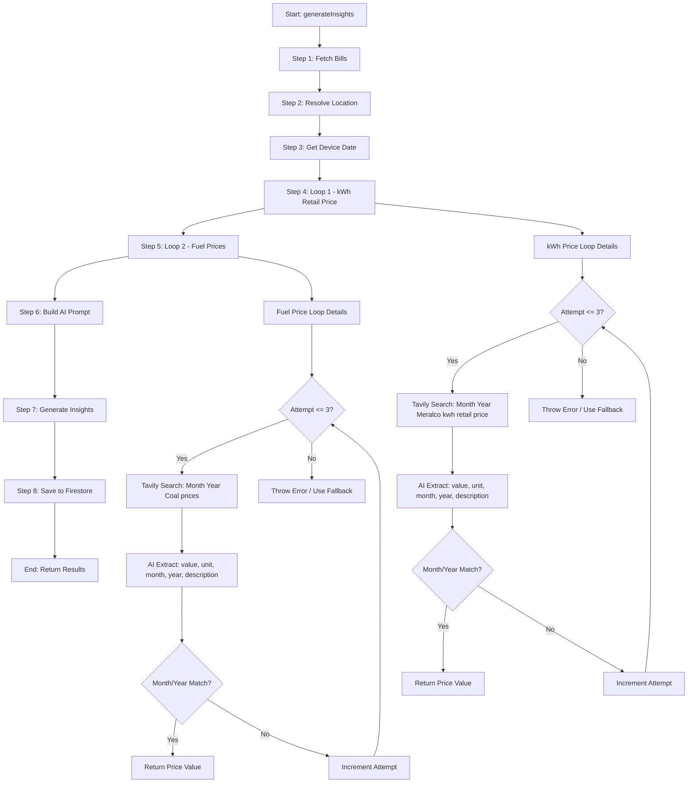
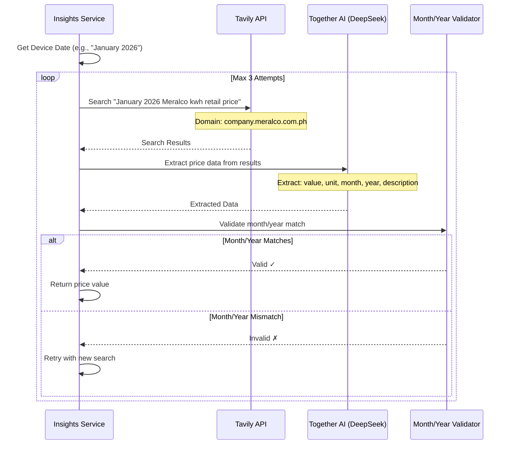
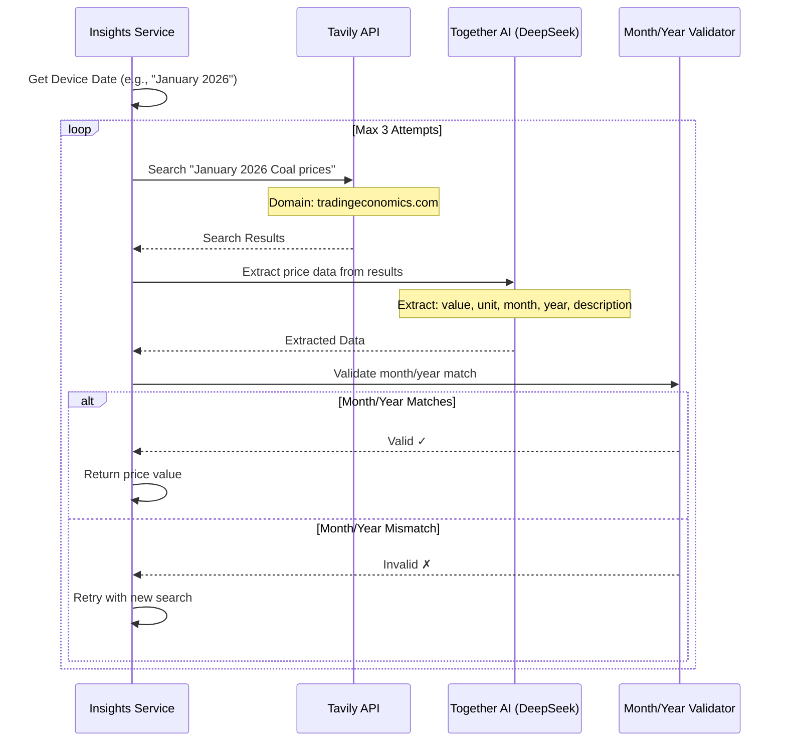
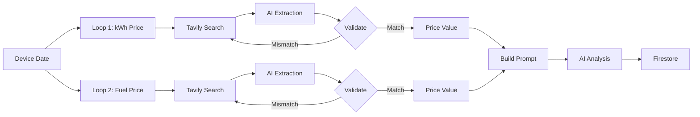
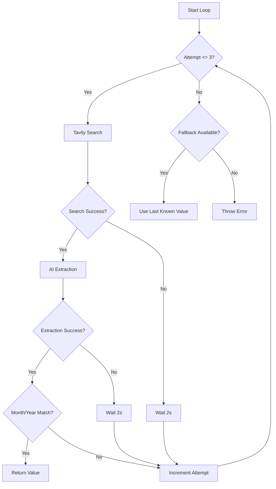

# Insights Service Flow Diagram

## New Architecture Flow



## Loop 1: kWh Retail Price Fetching



## Loop 2: Fuel Prices Fetching



## Data Flow



## Key Changes from Current Implementation

### Before (Current)

```
1. Fetch Bills
2. Single Web Search (all data at once)
   - Coal prices
   - Meralco rates
   - Temperature
3. AI analyzes everything together
4. Save results
```

### After (New)

```
1. Fetch Bills
2. Get Device Date
3. Individual Loop: kWh Retail Price
   - Search → Extract → Validate → Retry if needed
4. Individual Loop: Fuel Prices
   - Search → Extract → Validate → Retry if needed
5. AI analyzes with extracted prices
6. Save results
```

## Error Handling Flow



## Status Updates Timeline

```
User sees:
├─ "Fetching historical utility bills..." (Step 1)
├─ "Resolving user location..." (Step 2)
├─ "Fetching current Meralco kWh retail price..." (Step 4)
│  └─ (Loop may retry up to 3 times)
├─ "Fetching current coal prices..." (Step 5)
│  └─ (Loop may retry up to 3 times)
├─ "Preparing data for AI analysis..." (Step 6)
├─ "Generating AI insights..." (Step 7)
├─ "Saving insights securely..." (Step 8)
└─ "Done"
```
